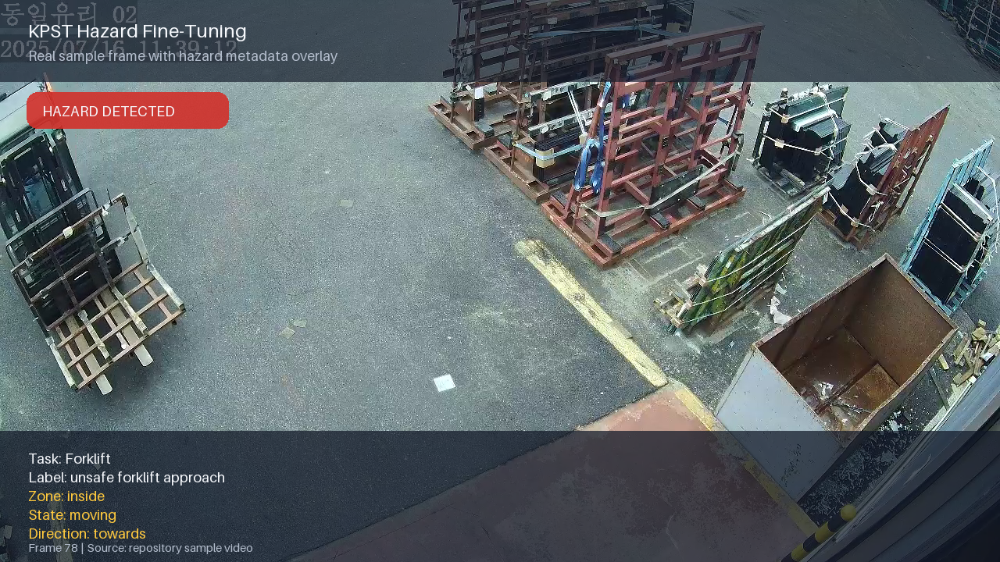

# KPST Hazard Fine-Tuning

KPST Hazard Fine-Tuning is a development pipeline for adapting multimodal video models to industrial hazard detection. The project focuses on fine-tuning LoRA adapters for factory safety scenarios such as forklift hazards and robot-arm hazards, with the long-term goal of enabling deployable hazard monitoring systems for factories across Korea. The intended outputs include structured hazard predictions, checkpoint evaluations, and visual video overlays that make model decisions easier to inspect and validate.



## What We Do

The project focuses on hazard recognition in industrial video, especially:

- forklift hazard scenarios
- robot-arm hazard scenarios
- combined multi-task training for both domains

In practice, the repo covers the full loop:

1. prepare raw video + JSON annotations
2. generate clip-level datasets and chat-style manifests
3. fine-tune video-capable models with LoRA
4. evaluate saved checkpoints
5. run inference on new videos
6. render overlays so predictions can be inspected visually

## Main Files

- `data_gen.py`: builds training/validation/test datasets from videos and JSON annotations
- `data_aug.py`: dataset augmentation helpers
- `train_qwen35_video_lora.py`: Qwen 3.5 video LoRA training
- `train_gemma4.py`: Gemma 4 video LoRA training
- `training_pause_resume.py`: safe pause/resume utilities for long training jobs
- `eval_lora_checkpoints.py`: checkpoint evaluation
- `infer_lora_video_inference.py`: runs LoRA inference on videos and exports structured results
- `infer_lora_video_overlay.py`: end-to-end inference plus overlay rendering
- `render_lora_video_overlay.py`: renders overlays from saved inference results
- `run_full_training_pipeline.sh`: example end-to-end training pipeline
- `run_all_infer_overlay.sh`: example inference and overlay pipeline

## Repository Layout

```text
.
|-- data/                     # sample source videos and annotations
|-- test/                     # sample test videos
|-- prompts/                  # task prompts used for training/inference
|-- vlm_dataset*/             # generated datasets and clips
|-- train_qwen35_video_lora.py
|-- train_gemma4.py
|-- infer_lora_video_overlay.py
|-- training_pause_resume.py
`-- run_full_training_pipeline.sh
```

## Setup

The repo includes a conda environment for the main V100 workflow:

```bash
conda env create -f environment.v100.yml
conda activate hazard_finetune_v100
```

Core packages listed in `requirements.v100.txt` include `transformers`, `peft`, `trl`, `opencv-python`, `pillow`, and `imageio-ffmpeg`.

## Basic Workflow

### 1. Build a dataset

```bash
python data_gen.py \
  --data-dir data \
  --out-dir vlm_dataset_both_aug \
  --task-mode both \
  --fork-prompt-file prompts/fork_prompt_v2.txt \
  --robot-prompt-file prompts/robot_propmt_v1.txt
```

### 2. Train a LoRA adapter

```bash
python train_qwen35_video_lora.py \
  --train_file vlm_dataset_both_aug/train_chat.jsonl \
  --val_file vlm_dataset_both_aug/val_chat.jsonl \
  --test_file vlm_dataset_both_aug/test_chat.jsonl \
  --output_dir runs/qwen35_9b_both_aug \
  --gradient_checkpointing \
  --use_fp16 \
  --pause_on_interrupt \
  --resume_from_checkpoint last
```

### 3. Evaluate checkpoints

```bash
python eval_lora_checkpoints.py \
  --adapter_dir runs/qwen35_9b_both_aug \
  --test_file vlm_dataset_both_aug/test_chat.jsonl \
  --project_root . \
  --task_mode both \
  --use_fp16
```

### 4. Run inference and render overlays

```bash
python infer_lora_video_overlay.py \
  --base_model Qwen/Qwen3.5-9B \
  --adapter_dir runs/qwen35_9b_both_aug/checkpoint-4796 \
  --video_dir test \
  --output_dir runs/infer_overlay_run \
  --task_mode both \
  --robot_prompt_file prompts/robot_propmt_v1.txt \
  --fork_prompt_file prompts/fork_prompt_v2.txt \
  --chunk_sec 5 \
  --num_frames 12 \
  --device cuda:0 \
  --save_overlay
```

## Pause And Resume Training

Long training runs can be paused safely. The pause/resume helper is documented in `training_pause_resume.py` and supports:

- pausing with a file trigger
- pausing on `Ctrl+C`
- resuming from the latest complete checkpoint with `--resume_from_checkpoint last`

That makes the repo easier to use on shared GPUs or long overnight jobs.

## Notes
- The shell scripts in the repo show the current training and inference commands used by the project.
